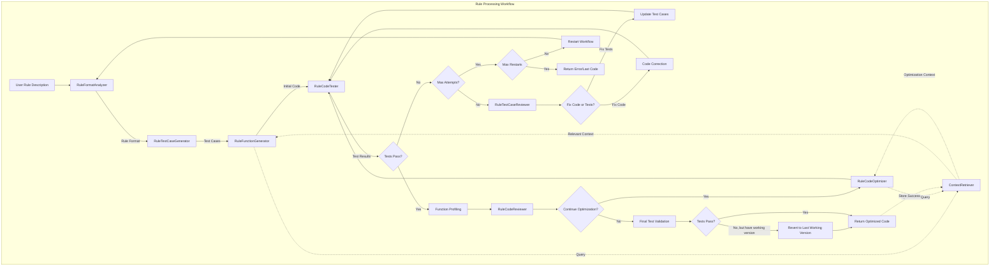

# Efficient Code Generation for Data Quality Rules with Multi-Agent Workflow

## Overview

This repository implements a multi-agent workflow for generating efficient and correct data quality rule evaluation functions. The system uses Large Language Models (LLMs) through a coordinated multi-agent architecture that iteratively improves code quality, correctness, and efficiency specifically for pandas DataFrame operations.

## Problem Statement

Implementing data quality rules for large datasets is challenging, requiring both correctness and efficiency. Current LLM-based code generation approaches often have limitations in consistency, efficiency, and correctness when handling complex data quality rules across millions of rows. This project aims to solve these challenges through specialized agents working together in a coordinated workflow.

## Architecture

The system employs a multi-agent architecture with specialized components:

### Rule Evaluation Agents
- **RuleFunctionGenerator**: Generates initial code for data quality rule evaluation
- **RuleCodeTester**: Tests the rule implementation against test cases
- **RuleCodeOptimizer**: Improves code efficiency using profiling data
- **RuleCodeReviewer**: Analyzes code quality and determines if further optimization is needed
- **RuleFormatAnalyzer**: Determines the appropriate output structure for different rule types
- **RuleTestCaseGenerator**: Creates test cases for validating rule implementations
- **RuleTestCaseReviewer**: Identifies whether failures are in the implementation or test cases

### Orchestration
- **RuleOrchestrator**: Coordinates the workflow between agents in iterative refinement cycles

### Retrieval System
- **ContextRetriever**: Retrieves relevant documentation, code snippets, and web resources
- **WebSearchIntegration**: Augments the knowledge base with targeted web searches

### Utilities
- **Code Execution**: Safely executes and profiles rule implementations
- **Context Retrieval**: Manages retrieval of relevant documentation and examples

## Workflow

1. **Format Analysis**: Analyze the rule description to determine correct output structure
2. **Test Case Generation**: Create test cases that validate rule implementation
3. **Initial Code Generation**: Generate initial rule implementation code
4. **Correctness Refinement**: Test and fix code until tests pass
5. **Code Review**: Analyze code for potential improvements
6. **Performance Optimization**: Profile code and optimize for efficiency
7. **Final Validation**: Ensure optimized code still passes tests



## Installation

```bash
# Clone the repository
git clone https://github.com/yourusername/efficient-code-genai.git
cd efficient-code-genai

# Install dependencies
pip install -r [requirements.txt](http://_vscodecontentref_/1)

# Create a .env file with your API keys
echo "LLM_API_KEY=your_api_key_here" > .env
```

## Usage

```python
from agents.rule_orchestrator import RuleOrchestrator
from config import Config

# Initialize configuration and orchestrator
config = Config()
orchestrator = RuleOrchestrator(config)

# Process a rule
result = orchestrator.process_rule(
    rule_description="If values in column A are greater than 10, then values in column B must be less than 5",
    dataframe=your_dataframe,
    sample_size=1000,  # Optional: use sample for development
    use_profiling=True  # Optional: enable performance profiling
)

# The generated function can be used directly
from utils.code_execution import execute_code
exec(result["code"])  # This defines the function in your environment
rule_result = execute_rule(your_dataframe)  # Execute the rule function
```

## Project Structure

```
__init__.py
config.py               # Configuration settings
agents/                 # Multi-agent components
    __init__.py
    base_agent.py       # Abstract base agent class
    rule_function_generator.py  # Initial code generation
    rule_code_tester.py         # Test execution
    rule_code_optimizer.py      # Code optimization
    rule_code_reviewer.py       # Code quality review
    rule_format_analyzer.py     # Rule output format analysis
    rule_test_case_generator.py # Test case generation
    rule_test_case_reviewer.py  # Test case review
    rule_orchestrator.py        # Workflow coordination
utils/
    __init__.py
    code_execution.py   # Safe code execution with metrics
    context_retrieval.py # Retrieval system implementation
    web_search.py       # Web search integration
data/
    retrieval_store/    # Storage for retrieved documents
```

## Research Context

This project is part of a master thesis investigating how retrieval-augmented multi-agent workflows can enhance the efficiency and correctness of LLM-generated code. The research explores:

1. Leveraging retrieval systems to provide relevant code snippets and context during generation
2. Designing multi-agent architectures that coordinate specialized agents for iterative code refinement
3. Measuring effectiveness of the proposed workflow compared to existing approaches

## License

[MIT License](LICENSE)